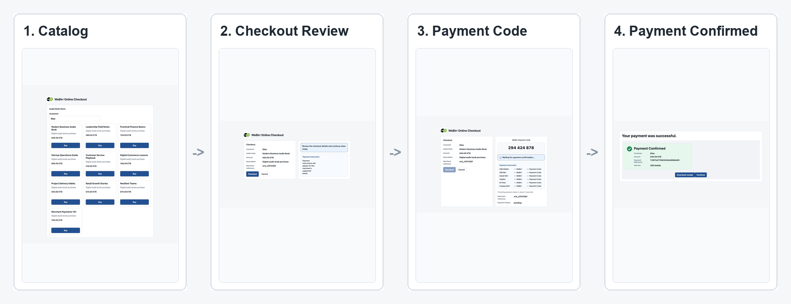
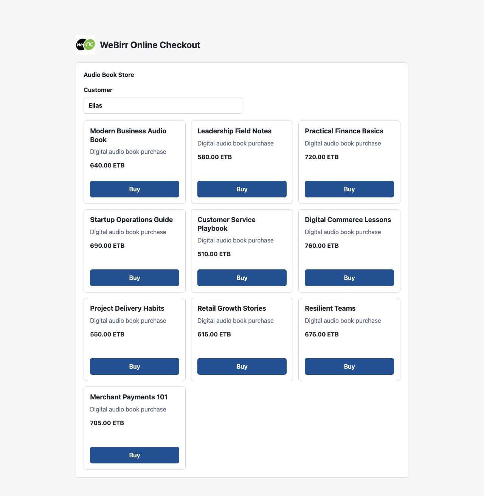
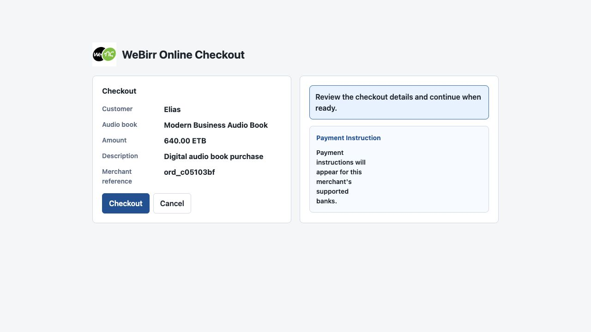
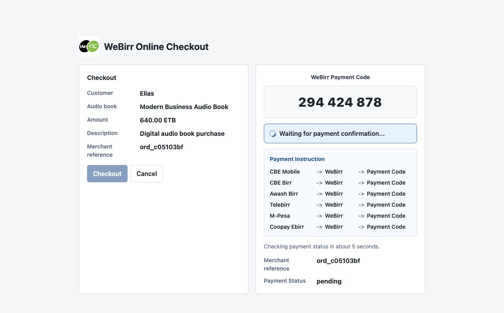
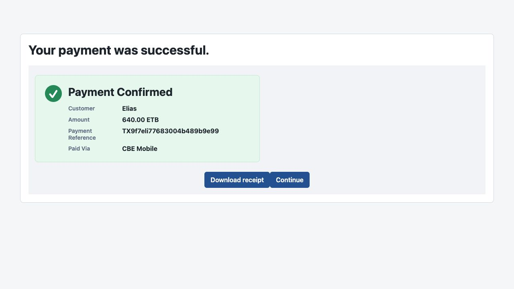

# WeBirr Checkout Next.js App Example



This is a runnable Next.js web app that demonstrates the merchant-owned WeBirr
online checkout pattern.

The app shows:

- a 10-item audio book catalog;
- a local checkout review panel;
- a checkout panel that displays the WeBirr Payment Code;
- merchant-owned create and status endpoints;
- SQLite-backed retry and recovery state;
- a `.txt` digital audio book receipt after paid confirmation;
- mock mode for local UI checks;
- optional WeBirr TestEnv or ProdEnv mode.

The browser uses `@webirr/checkout-js` and calls only merchant-owned Next.js
routes:

| Route | Purpose |
| --- | --- |
| `POST /api/demo/orders` | Create a local SQLite order from selected audio book and customer name. |
| `POST /api/webirr/checkout` | Create or resume the WeBirr payment code. |
| `GET /api/webirr/checkout/status?merchantReference=...` | Poll status and complete the local payable when paid. |
| `GET /api/demo/receipt?merchantReference=...` | Download the demo receipt after payment is confirmed. |

The server routes use `@webirr/checkout-next`, backed by
`@webirr/checkout-core`. Mock mode uses a local mocked gateway. TestEnv and
ProdEnv modes use the WeBirr SDK from the server route. All modes return
merchant-supported banks, and the browser renders payment instructions only from
that returned list.

## Run

Mock mode needs no WeBirr credentials:

```bash
npm install
npm run build
npm --workspace examples/checkout-nextjs-app run dev
```

Open:

```text
http://localhost:3000
```

The example creates a local SQLite database named
`webirr-checkout-demo.sqlite3`. It is ignored by Git.

## TestEnv Mode

TestEnv mode uses WeBirr merchant credentials from server-side environment
variables and never exposes them to the browser:

```bash
WEBIRR_MERCHANT_ID=replace-with-testenv-merchant-id \
WEBIRR_API_KEY=replace-with-testenv-api-key \
WEBIRR_TEST_MODE=true \
npm --workspace examples/checkout-nextjs-app run dev
```

The example creates a fresh local `ord_{shortuuid}` merchant reference when the
customer clicks `Buy`.

## ProdEnv Mode

ProdEnv mode is for merchant production deployments of the checkout kit. It uses
production credentials only on the server side:

```bash
WEBIRR_MERCHANT_ID=replace-with-production-merchant-id \
WEBIRR_API_KEY=replace-with-production-api-key \
WEBIRR_TEST_MODE=false \
npm --workspace examples/checkout-nextjs-app run dev
```

Do not use production credentials for screenshots, local demos, or CI smoke
checks. Use mock mode or TestEnv mode for those cases.

## Demo Flow

The home page shows an audio book store with 10 books. Customer name defaults
to `Elias` and cannot be empty. The browser sends only the selected book ID and
customer name to `POST /api/demo/orders`; the server resolves amount, currency,
and description from the catalog and stores the order in SQLite.

The visible flow is:

```text
Catalog -> Checkout Review -> WeBirr Payment Code -> Payment Confirmed -> Receipt
```

## Screenshots

### Audio Book Catalog

The customer starts from the audio book catalog, enters a customer name, and
chooses a book with **Buy**.



### Checkout Review

The checkout review shows the merchant-owned payable before WeBirr checkout
starts. Payment instructions remain informational until the checkout creates the
payment code.



### Payment Code Display

The checkout panel displays the **WeBirr Payment Code**, supported payment
instructions, merchant reference, and pending status.



### Payment Confirmation

After server-side payment verification, the success page shows the payment
reference, paid-via value, and receipt download link.



## Docker Compose

The example directory includes a Docker Compose file for running the checkout
against WeBirr TestEnv by default when merchant credentials are supplied:

```bash
WEBIRR_MERCHANT_ID=replace-with-testenv-merchant-id \
WEBIRR_API_KEY=replace-with-testenv-api-key \
WEBIRR_TEST_MODE=true \
docker compose up
```

The app will be available at `http://localhost:3100` by default. Use
`WEBIRR_TEST_MODE=true` or `WEBIRR_TEST_MODE=false` to choose TestEnv or
ProdEnv, `WEBIRR_CHECKOUT_EXAMPLE_PORT` to choose another local port, and
If `WEBIRR_MERCHANT_ID` and `WEBIRR_API_KEY` are omitted, the example falls back
to mock mode.

This example does not use browser-side WeBirr credentials and does not call
WeBirr merchant APIs from the browser.

## SQLite Store

The example stores checkout/payment state in SQLite:

```text
id
merchant_reference
demo_type
item_id
item_title
customer_name
amount
currency
description
webirr_payment_code
webirr_payment_status
webirr_payment_reference
webirr_paid_via
created_at
updated_at
paid_at
reversed_at
```

`merchant_reference` is the merchant-owned durable key. Platform-specific data
such as cart items, booking details, course IDs, shipping addresses, or tax rows
should stay in the merchant application's own tables.

## Status Values

Use the WeBirr status model:

```text
0 pending/not paid
1 paid-unconfirmed/in progress
2 paid
3 reversed/canceled
```

## Validate

From the repository root:

```bash
npm test
npm run test:example
npm run build:example
```
