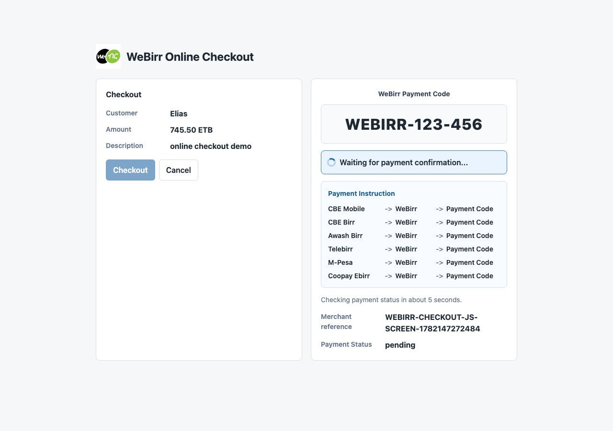
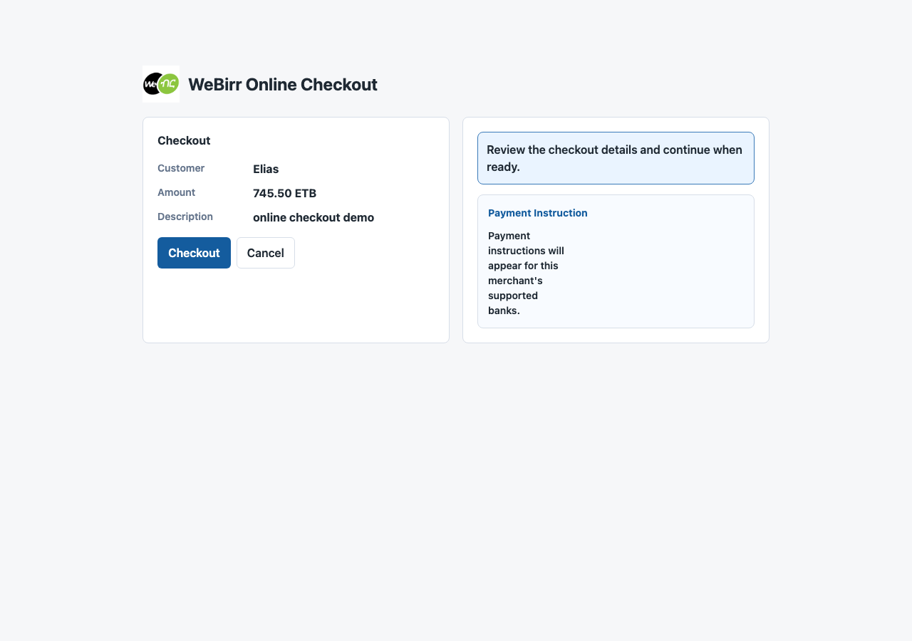
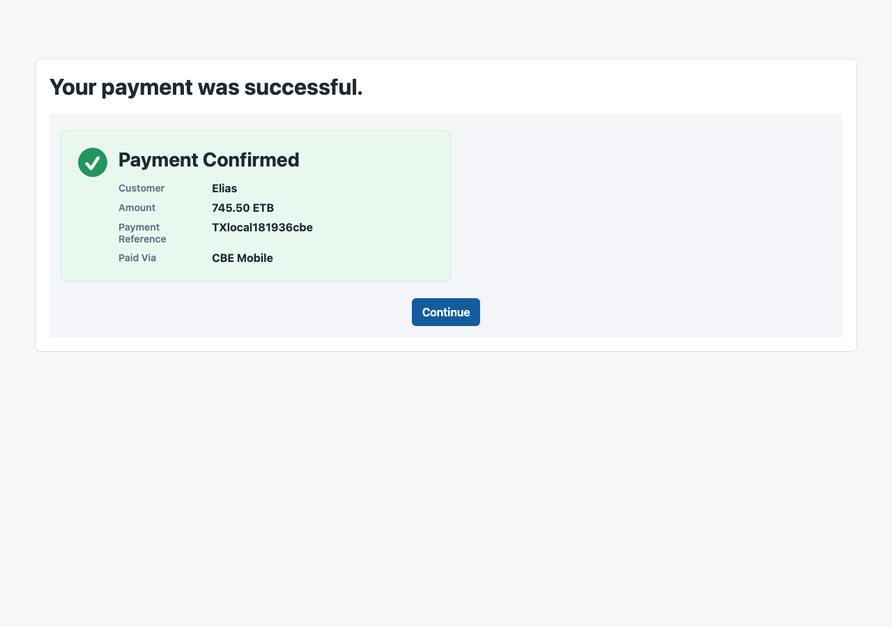
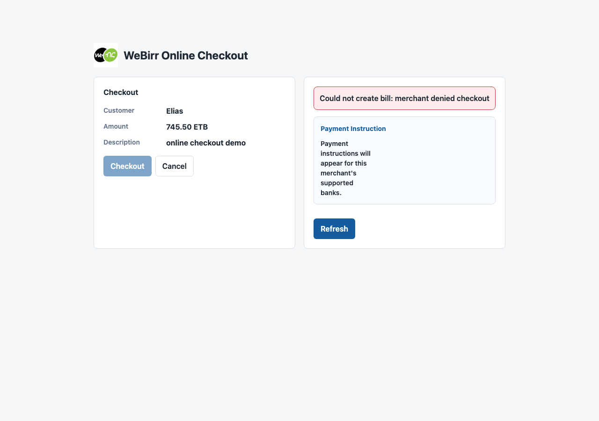

# WeBirr Checkout Kit Next.js Example



This example demonstrates the checkout kit with a Moodle-inspired WeBirr
checkout screen. Mock mode is the default and does not require WeBirr
credentials.

The browser uses `@webirr/checkout-js` and calls only merchant-owned Next.js
routes:

- `POST /api/webirr/checkout`
- `GET /api/webirr/checkout/status?merchantReference=ORDER-1001`

The server routes use `@webirr/checkout-next`, backed by
`@webirr/checkout-core`. In mock mode, a local mocked gateway returns pending
for the first polls, then returns paid. TestEnv and ProdEnv modes use the
WeBirr SDK from the server route. All modes return merchant-supported banks, and
the browser renders payment instructions only from that returned list.

## Mock Mode

Run locally without credentials:

```bash
npm install
npm run build
npm --workspace examples/nextjs-mock run dev
```

## TestEnv Mode

TestEnv mode uses the existing `webirr` SDK on the server route only. It reads
TestEnv merchant credentials from server-side environment variables and never
exposes them to the browser.

```bash
WEBIRR_CHECKOUT_MODE=testenv \
WEBIRR_TEST_ENV_MERCHANT_ID=replace-with-testenv-merchant-id \
WEBIRR_TEST_ENV_API_KEY=replace-with-testenv-api-key \
NEXT_PUBLIC_WEBIRR_EXAMPLE_REFERENCE=ORDER-1001 \
npm --workspace examples/nextjs-mock run dev
```

Use a fresh `NEXT_PUBLIC_WEBIRR_EXAMPLE_REFERENCE` when you want to create a new
TestEnv bill instead of resuming the existing bill for the same merchant
reference. Complete the payment through the internal WeBirr TestEnv payment
simulator supplied for testing.

`WEBIRR_CHECKOUT_MODE=live` is kept as a backward-compatible alias for
`testenv`; new commands should use `testenv`.

## ProdEnv Mode

ProdEnv mode is for merchant-owned production deployments of the checkout kit.
It uses production credentials only on the server side:

```bash
WEBIRR_CHECKOUT_MODE=prod \
WEBIRR_PROD_MERCHANT_ID=replace-with-production-merchant-id \
WEBIRR_PROD_API_KEY=replace-with-production-api-key \
NEXT_PUBLIC_WEBIRR_EXAMPLE_REFERENCE=ORDER-1001 \
npm --workspace examples/nextjs-mock run dev
```

Do not use production credentials for screenshots, local demos, or CI smoke
checks. Use mock mode or TestEnv mode for those cases.

For browser testing, you can also pass a fresh reference at runtime:

```text
http://localhost:3000/?merchantReference=NEXTJS-LIVE-20260618000000
```

## Docker Compose

The example directory includes a Docker Compose file for running the checkout
against WeBirr TestEnv by default. It requires only the TestEnv merchant id and
API key:

```bash
WEBIRR_TEST_ENV_MERCHANT_ID=replace-with-testenv-merchant-id \
WEBIRR_TEST_ENV_API_KEY=replace-with-testenv-api-key \
docker compose up
```

The app will be available at `http://localhost:3100` by default. Use
`WEBIRR_CHECKOUT_MODE=testenv` or `WEBIRR_CHECKOUT_MODE=prod` to choose the
server-side gateway mode, `WEBIRR_CHECKOUT_EXAMPLE_PORT` to choose another
local port, and optionally use `NEXT_PUBLIC_WEBIRR_EXAMPLE_REFERENCE` when you
need a specific merchant reference for repeatable screenshots or recovery
testing.

When testing against a restored local gateway database, set
`WEBIRR_GATEWAY_BASE_URL` to the local gateway URL. From Docker on macOS, use
`http://host.docker.internal:8080`.

This example does not use browser-side WeBirr credentials and does not call
WeBirr merchant APIs from the browser.

## Screenshots

### Checkout Review

The customer reviews the merchant-owned payable before the WeBirr Payment Code
is created.



### Payment Code Waiting

The checkout displays the WeBirr Payment Code and instructions generated from
the merchant-supported bank list returned by the backend.


### Payment Confirmed

The paid state shows the standard online-checkout confirmation fields:
Customer, Amount, Payment Reference, and Paid Via.



### Error And Manual Refresh

Manual refresh appears only after an error. Normal polling is automatic and
sequential.


